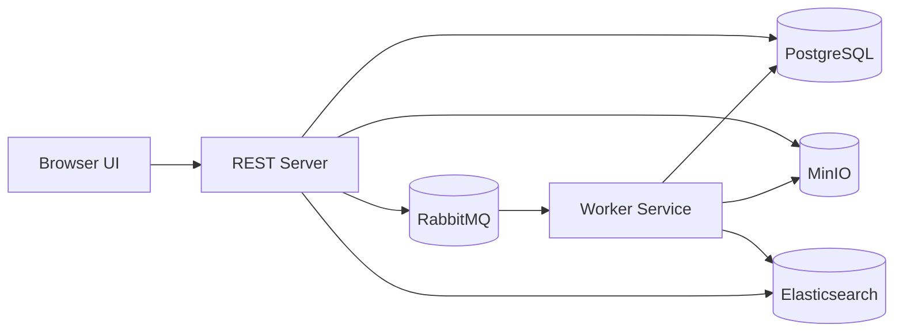

# Document System

A document management system for uploading, storing, searching, and reading PDF documents with a microservice-based architecture.

The project combines a Spring Boot REST backend, an asynchronous worker service, object storage, full-text search, and a lightweight browser UI. Uploaded documents are stored in MinIO, indexed for search, processed asynchronously for OCR, and then made available for reading, metadata editing, and comments.

## Highlights

- PDF upload and document management
- Metadata editing for filename, summary, and tags
- Full-text document search with Elasticsearch
- Asynchronous processing via RabbitMQ
- OCR-based text extraction for uploaded PDFs
- Browser-based reading mode for extracted document text
- Comment system for document collaboration
- Docker Compose setup for the full local stack

## Architecture



## How It Works

1. A user uploads a PDF through the UI.
2. The REST server stores the file in MinIO and saves metadata in PostgreSQL.
3. The REST server publishes a processing message to RabbitMQ.
4. The worker service consumes the message, extracts text with OCR, and updates search data.
5. The UI can then display the file, show metadata, load extracted text, and search indexed content.

## Tech Stack

### Backend

- Java 21
- Spring Boot
- Spring Web
- Spring Data JPA
- Spring AMQP
- MapStruct
- Lombok

### Infrastructure

- PostgreSQL
- RabbitMQ
- MinIO
- Elasticsearch
- Docker Compose

### Processing

- Tess4J / Tesseract OCR
- Optional GenAI integration in the worker service

### Frontend

- HTML
- CSS
- Vanilla JavaScript
- Nginx

## Project Structure

```text
document_system/
|-- rest-server/      REST API, document metadata, file streaming, search endpoints
|-- worker-service/   Async processing, OCR, indexing, enrichment
|-- ui/               Static frontend served through Nginx
|-- docker-compose.yml
|-- pom.xml
```

## Main Features

### Document Dashboard

- List all uploaded documents
- Open PDFs directly in the browser
- Delete documents
- Search documents by indexed content

### Document Details

- View document metadata
- Edit filename, summary, and tags
- Open the original PDF
- Add and display comments

### Reader Mode

- Load extracted OCR text for a document
- Read text word-by-word in a focused reading interface
- Control reading speed
- Preserve reading progress in local storage

## API Overview

The REST server exposes endpoints under `/api`.

### Document endpoints

- `POST /api/documents/upload`
- `GET /api/documents`
- `GET /api/documents/{id}`
- `PUT /api/documents/{id}`
- `DELETE /api/documents/{id}`
- `GET /api/documents/{id}/file`
- `GET /api/documents/{id}/text`
- `GET /api/documents/search?query=...`

### Comment endpoints

- `POST /api/comments/document/{documentId}`
- `GET /api/comments/document/{documentId}`
- `DELETE /api/comments/{commentId}`

## Running The Project

### Prerequisites

- Docker
- Docker Compose

### Start the full stack

```bash
docker compose up --build
```

This starts:

- `ui` on `http://localhost:8080`
- `rest-server` on `http://localhost:8081`
- `worker-service` on `http://localhost:8082`
- `postgres` on `localhost:5432`
- `rabbitmq` on `http://localhost:15672`
- `minio` on `http://localhost:9001`
- `elasticsearch` on `http://localhost:9200`

## Configuration Notes

The services are wired together through Docker Compose.

Important runtime dependencies include:

- PostgreSQL for metadata persistence
- MinIO for PDF file storage
- RabbitMQ for async job dispatch
- Elasticsearch for full-text search

The worker service also supports external AI-based processing through an API key loaded from environment variables. If you want to use that part of the pipeline, make sure the required variable is available in `api.env`.

## Development Notes

- The REST server is responsible for upload, metadata management, comments, file delivery, and search orchestration.
- The worker service handles background processing and indexing.
- The frontend is intentionally lightweight and does not require a JS framework.
- The project is organized as a multi-module Maven setup.

## Why This Project Matters

This project demonstrates more than CRUD. It combines:

- synchronous and asynchronous service communication
- storage and search infrastructure
- OCR-based document processing
- backend API design
- microservice-style decomposition
- an end-to-end usable interface

## Future Improvements

- Authentication and user roles
- Better document versioning
- Advanced filtering and faceted search
- Highlighted search matches in the UI
- Processing status indicators per document
- Test coverage expansion and CI pipeline

## Screens and Diagrams

The repository also contains UML diagrams for the REST server and worker service, which help explain the internal structure and dependencies.

## Author

Created by Ibrahim Barakat.
